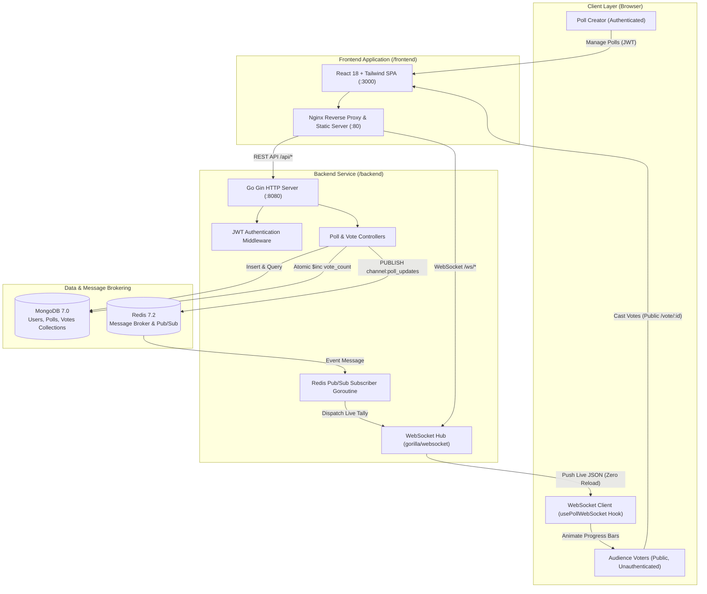

# PulsePoll - Real-Time Live Polling Platform

PulsePoll is a production-grade, distributed real-time live polling application. It allows authenticated creators to launch live polls, distribute instant shareable links, and receive audience votes with zero-latency live updates streamed directly to participants' screens via WebSockets and Redis Pub/Sub.

---

## Architecture Diagram



---

## Key Architecture Decisions

### 1. MongoDB for Polls, Aggregations, and Discrete Votes
- **Embedded Document Design**: Poll options are embedded directly within each Poll document (`options: [{ id, text, vote_count }]`). This allows a single round-trip read to fetch a poll and its live tallies.
- **Atomic Concurrency**: Vote tallying leverages MongoDB's atomic `$inc` operator on `options.$.vote_count` and `total_votes`, preventing race conditions under high concurrency.
- **Audit Ledger & Fraud Prevention**: A discrete `votes` collection records every cast vote with a compound unique index on `{ poll_id: 1, voter_identifier: 1 }`, guaranteeing that a voter cannot double-vote in the same poll while maintaining sub-millisecond query performance.

### 2. Redis Pub/Sub as the Distributed Message Broker
- **Decoupled Fan-Out**: Casting a vote is an HTTP transaction, while receiving updates is an asynchronous WebSocket event. By publishing vote events to Redis channel `channel:poll_updates`, the backend separates vote ingestion from WebSocket broadcast processing.
- **Horizontal Scalability**: In a multi-replica container deployment, clients can connect their WebSockets to different backend pods. When any pod records a vote, Redis broadcasts the event to all pods, which in turn push the update to their connected clients without requiring sticky sessions.

### 3. Go & Gin Framework for High-Performance Concurrency
- **Goroutine-Driven WebSocket Hub**: Go's lightweight green threads (goroutines) enable the server to hold thousands of concurrent WebSocket connections with minimal RAM usage.
- **Gorilla WebSocket**: Provides robust connection lifecycle management, ping/pong heartbeats to prune dead TCP sockets, and buffered non-blocking channel sends.
- **Strict Server-Side Validation**: All incoming requests are strictly validated prior to touching database operations (e.g. minimum/maximum string lengths, email parsing, unique poll options, existence of option IDs).

### 4. React 18 + Vite + Tailwind CSS for Isolated UI
- **Strict Separation of Concerns**: All frontend code lives strictly inside `/frontend` with its own build pipeline, dependencies, and environment configurations.
- **Zero Page Refresh**: The `usePollWebSocket` custom hook listens for real-time live events and triggers reactive DOM re-renders with smooth CSS width transitions.
- **Zero-Friction Public Voting**: The `/vote/:id` interface is accessible to anyone with the link; no login or registration is required to cast a vote.

---

## Directory Structure

```text
guvi/
├── backend/                        # Person 2: Go Gin API & WebSocket service
│   ├── cmd/
│   │   └── server/
│   │       └── main.go             # Application entrypoint & HTTP server
│   ├── internal/
│   │   ├── broker/
│   │   │   └── redis_pubsub.go     # Redis publisher & subscriber routines
│   │   ├── config/
│   │   │   └── config.go           # Environment variable loader
│   │   ├── database/
│   │   │   ├── mongo.go            # MongoDB client & collection indexes
│   │   │   └── redis.go            # Redis client connection
│   │   ├── handlers/
│   │   │   ├── auth_handler.go     # Signup, Login, Me endpoints
│   │   │   ├── poll_handler.go     # Poll CRUD, Vote casting with validation
│   │   │   └── ws_handler.go       # WebSocket upgrade & room dispatcher
│   │   ├── middleware/
│   │   │   ├── auth_middleware.go  # JWT Bearer token authentication
│   │   │   └── cors_middleware.go  # Cross-origin resource sharing
│   │   ├── models/
│   │   │   ├── poll.go             # Poll & Option structs & validation logic
│   │   │   ├── user.go             # User model & bcrypt password hashing
│   │   │   └── vote.go             # Vote schema model
│   │   └── websocket/
│   │       ├── client.go           # WebSocket client connection pump & ping/pong
│   │       └── hub.go              # WebSocket room management & broadcasting
│   ├── Dockerfile                  # Multi-stage production Go build
│   ├── .dockerignore
│   └── go.mod
│
├── frontend/                       # Person 1: React & UI Application
│   ├── src/
│   │   ├── components/
│   │   │   ├── AuthModal.jsx       # Login & Register modal dialog
│   │   │   ├── CreatePollModal.jsx # Dynamic poll creation form
│   │   │   └── Navbar.jsx          # Header with navigation & auth state
│   │   ├── context/
│   │   │   └── AuthContext.jsx     # User authentication state provider
│   │   ├── hooks/
│   │   │   └── usePollWebSocket.js # Real-time WebSocket hook with auto-reconnect
│   │   ├── pages/
│   │   │   ├── DashboardPage.jsx   # Authenticated poll management dashboard
│   │   │   └── VotePage.jsx        # Public shareable voting interface & live chart
│   │   ├── services/
│   │   │   └── api.js              # REST API client & voter fingerprinting
│   │   ├── App.jsx                 # Client-side router & modal coordinator
│   │   ├── index.css               # Tailwind CSS & smooth animations
│   │   └── main.jsx                # React root
│   ├── nginx.conf                  # Nginx proxy config for production container
│   ├── Dockerfile                  # Multi-stage Vite build + Nginx Alpine
│   ├── .dockerignore
│   ├── package.json
│   ├── tailwind.config.js
│   ├── postcss.config.js
│   └── vite.config.js
│
├── mongodb-init/                   # Person 3: Database & DevOps
│   └── init-mongo.js               # MongoDB schema validators and index initialization
├── redis/
│   └── redis.conf                  # Redis configuration optimized for Pub/Sub
├── docker-compose.yml              # Complete local multi-container orchestration
├── DEPLOYMENT.md                   # Production deployment strategy to public live URLs
└── README.md                       # Documentation & usage guide
```

---

## Quick Start with Docker Compose

The easiest way to run the entire stack locally is using Docker Compose. It orchestrates MongoDB, Redis, the Go backend, and the React frontend with full networking and health checks.

### Prerequisites
- Docker Engine `24.0+`
- Docker Compose `v2+`

### 1. Build and Start All Services
```bash
docker compose up --build
```

Docker Compose will:
1. Initialize **MongoDB 7.0** and execute `mongodb-init/init-mongo.js` to create indexes.
2. Initialize **Redis 7.2** with Pub/Sub buffer optimizations.
3. Compile the Go backend binary in a multi-stage Docker build and wait for MongoDB and Redis health checks to pass.
4. Build the React frontend production bundle and serve it via Nginx on port `3000`.

### 2. Access the Application
- **Frontend Web App**: [http://localhost:3000](http://localhost:3000)
- **Backend API**: [http://localhost:8080/api](http://localhost:8080/api)
- **API Health Check**: [http://localhost:8080/health](http://localhost:8080/health)
- **WebSocket Endpoint**: `ws://localhost:8080/ws/polls/:id`

---

## Local Development Without Docker

If you prefer to run services natively on your host machine:

### 1. Start MongoDB and Redis
```bash
# Start MongoDB (default port 27017)
mongod --dbpath ./data/db

# Start Redis (default port 6379)
redis-server ./redis/redis.conf
```

### 2. Start Go Backend
```bash
cd backend

# Download dependencies
go mod tidy

# Run server
go run ./cmd/server
# Server will listen on http://localhost:8080
```

### 3. Start React Frontend
```bash
cd frontend

# Install dependencies
npm install

# Start Vite dev server
npm run dev
# Vite will serve on http://localhost:3000 with auto-proxying to :8080
```

---

## API Reference

### Authentication Endpoints

#### `POST /api/auth/signup`
Register a new user account.
- **Request Body**:
```json
{
  "name": "Alex Miller",
  "email": "alex@example.com",
  "password": "securepassword123"
}
```
- **Response `201 Created`**:
```json
{
  "token": "eyJhbGciOiJIUzI1NiIsInR5cCI6IkpXVCJ9...",
  "user": {
    "id": "664fa1e2b58c7e0012345678",
    "name": "Alex Miller",
    "email": "alex@example.com",
    "created_at": "2026-09-19T10:30:00Z"
  }
}
```

#### `POST /api/auth/login`
Authenticate an existing user.
- **Request Body**:
```json
{
  "email": "alex@example.com",
  "password": "securepassword123"
}
```
- **Response `200 OK`**: Returns JWT token and user profile.

#### `GET /api/auth/me` *(Protected: Bearer Token required)*
Get the current authenticated user profile.

---

### Poll Endpoints

#### `POST /api/polls` *(Protected: Bearer Token required)*
Create a new live poll.
- **Request Body**:
```json
{
  "question": "Which programming language do you use most for web APIs?",
  "options": ["Go", "Node.js", "Python", "Rust"]
}
```
- **Response `201 Created`**:
```json
{
  "id": "664fa3f8b58c7e0012345679",
  "creator_id": "664fa1e2b58c7e0012345678",
  "creator_name": "Alex Miller",
  "question": "Which programming language do you use most for web APIs?",
  "options": [
    { "id": "1b9d6bcd-bbfd-4b2d-9b5d-ab8dfbbd4bed", "text": "Go", "vote_count": 0 },
    { "id": "6ec0bd7f-11c0-43da-975e-2a8ad9ebae0b", "text": "Node.js", "vote_count": 0 },
    { "id": "c73bcdcc-2669-4bf6-81d3-e4ae73fb11be", "text": "Python", "vote_count": 0 },
    { "id": "93699c2d-cd79-4560-84a5-9f5b66d48b78", "text": "Rust", "vote_count": 0 }
  ],
  "total_votes": 0,
  "status": "active",
  "created_at": "2026-09-19T10:32:00Z",
  "updated_at": "2026-09-19T10:32:00Z"
}
```

#### `GET /api/polls/user` *(Protected: Bearer Token required)*
List all polls created by the authenticated user.

#### `GET /api/polls/:id` *(Public - No Auth)*
Retrieve details and current vote tallies for a poll.

#### `POST /api/polls/:id/vote` *(Public - No Auth)*
Cast a vote for an option.
- **Request Body**:
```json
{
  "option_id": "1b9d6bcd-bbfd-4b2d-9b5d-ab8dfbbd4bed"
}
```
- **Response `200 OK`**:
```json
{
  "message": "Vote successfully recorded",
  "poll": {
    "id": "664fa3f8b58c7e0012345679",
    "question": "Which programming language do you use most for web APIs?",
    "options": [
      { "id": "1b9d6bcd-bbfd-4b2d-9b5d-ab8dfbbd4bed", "text": "Go", "vote_count": 1 },
      { "id": "6ec0bd7f-11c0-43da-975e-2a8ad9ebae0b", "text": "Node.js", "vote_count": 0 },
      { "id": "c73bcdcc-2669-4bf6-81d3-e4ae73fb11be", "text": "Python", "vote_count": 0 },
      { "id": "93699c2d-cd79-4560-84a5-9f5b66d48b78", "text": "Rust", "vote_count": 0 }
    ],
    "total_votes": 1,
    "status": "active"
  }
}
```

#### `DELETE /api/polls/:id` *(Protected: Bearer Token required)*
Delete a poll created by the authenticated user and clean up associated vote records.

---

## WebSocket Protocol

### Connection
- **URL**: `ws://<host>/ws/polls/<poll_id>`
- Upon connection, the backend immediately pushes an initial poll update packet.
- Heartbeats are maintained automatically via WebSocket ping/pong frames every 54 seconds.

### Live Update Frame Structure
Whenever any voter casts a vote, Redis Pub/Sub dispatches this frame to all connected WebSocket clients:
```json
{
  "type": "poll_update",
  "poll_id": "664fa3f8b58c7e0012345679",
  "question": "Which programming language do you use most for web APIs?",
  "options": [
    { "id": "1b9d6bcd-bbfd-4b2d-9b5d-ab8dfbbd4bed", "text": "Go", "vote_count": 12 },
    { "id": "6ec0bd7f-11c0-43da-975e-2a8ad9ebae0b", "text": "Node.js", "vote_count": 7 },
    { "id": "c73bcdcc-2669-4bf6-81d3-e4ae73fb11be", "text": "Python", "vote_count": 4 },
    { "id": "93699c2d-cd79-4560-84a5-9f5b66d48b78", "text": "Rust", "vote_count": 19 }
  ],
  "total_votes": 42,
  "timestamp": "2026-09-19T10:35:42.128Z"
}
```

---

## Production Deployment
See [DEPLOYMENT.md](file:///Users/vishwajeetsingh/Desktop/guvi/DEPLOYMENT.md) for step-by-step instructions on deploying the full stack to publicly reachable URLs using cloud providers (Render, Railway, Fly.io, or VPS with Automated Let's Encrypt SSL).
